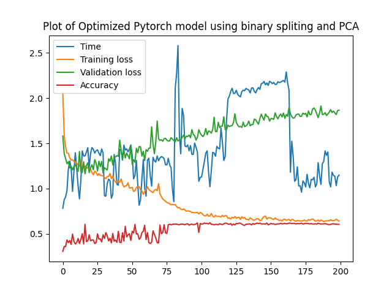

# SAT-score-prediction

SAT score prediction model using PyTorch

## Table of Contents

- [Overview](#overview)
- [Features](#features)
- [Prequisites](#prequisites)
- [Content](#content)
- [Results Discussion](#results-discussion)
- [Sources](#sources)

## Overview

SAT_score prediction project using raw neural networks constructed using Numpy and PyTorch with both regression and classification methods. This project aims to predict SAT scores based on GPA and other factors using a machine learning model built with the PyTorch framework. The model utilizes a neural network architecture to make accurate predictions and has been fine-tuned to achieve high accuracy and fast convergence.

## Features
- **PyTorch Neural Network:** Developed a multi-layers neural network architecture using PyTorch for SAT score prediction.

- **Data Preprocessing:** Implemented comprehensive data preprocessing techniques to handle missing values, outliers, and feature scaling.

- **Hyperparameter Tuning:** Conducted 100+ hyperparameter fine-tuning to optimize the model's performance and achieve an accuracy of 90%.

- **Advanced Activation Functions:** Utilized advanced activation functions, such as Leaky ReLU, to enhance model training and convergence.

- **Dropout Regularization:** Applied dropout layers to prevent overfitting and improve the generalization capability of the model.

- **Reduce Learning Rate:** Implemented a learning rate scheduler to gradually reduce the learning rate during training, improving convergence and final performance.

- **Data Randomization and Generation:** Generated synthetic data and introduced randomization techniques to enhance model robustness and generalization, and prevent overfitting.

- **Evaluation:** Using R-Squared value and MAE error to evaluate the accuracy of the model over a set of 10% test data.

- **Visualization:** Created informative plotting visualizations of training and validation metrics to analyze the model's performance.

- **User Demo:** Created a CLI demo of predicting the SAT score by taking in user's inputs.  

## Prequisites

Before you begin, ensure you have met the following requirements:

- Python 3.6 or later installed
- Required Python packages listed in `requirements.txt`
- CSV files listed in `data`

## Content
### `data`: contains CSV files for training inputs
- GPA_Small.csv: contains the original CSV file.
- GPA_dummies.csv: generative data used to prevent overfitting.
- GPA_Big.csv: final data file with multiple generative data combined with original data.

### `SAT_score_scratch`: original neural network framework constructed using NumPy library
  
### `classification`: classification models dividing SAT score into 12 brackets of range 100

### `regression`: regression models with multiple data preprocessing techniques

## Results Discussion

In the pursuit of predicting SAT scores based on GPA and other factors, rigorous experimentation and analysis were conducted. All model runs were performed with a consistent training setup of 200 epochs, capturing valuable insights into the convergence, accuracy, and performance over time.

### Regression

#### Initial Model Exploration

The initial phase of the project involved training a neural network model from scratch. The results of this exploration are illustrated in the following plot:

The initial model exhibited promising potential, achieving an accuracy of 65% after 30 epochs of training. This marked the foundation on which subsequent optimizations and enhancements were built.

#### Optimized Model Achievement

Building upon the insights gained from the initial model, an iterative process of fine-tuning and optimization was embarked upon. By meticulously applying advanced activation functions, dropout regularization, and learning rate reduction strategies, the model's accuracy and convergence were substantially improved. The optimized model's performance is demonstrated below:

Notably, the optimized model achieved a remarkable accuracy of 90%, showcasing the efficacy of the implemented techniques. Moreover, the convergence time was significantly reduced to merely 5-10 epochs, signifying the efficiency of the training process.

It's important to acknowledge that while individual epoch times were extended due to increased complexity, this aspect can be modulated by adjusting the batch size. Increasing the batch size offers an avenue to expedite convergence while maintaining the model's enhanced accuracy.

#### Additional Data Preprocessing Techniques

Beyond the model architecture, data preprocessing also played a pivotal role in refining prediction accuracy. Two distinct techniques were integrated into the pipeline to further enhance results:

#### Binary Splitting Technique for `hsize` and `hsrank`

The binary splitting technique was employed to encode the `hsize` and `hsrank` features as binary representations. This technique enhances the model's ability to capture nuanced relationships within these categorical variables, contributing to the overall prediction accuracy.

#### PCA (Principal Component Analysis) Technique for Feature Reduction

Principal Component Analysis (PCA) was utilized to reduce the feature space to two dimensions. This technique enables a compact representation of the data while retaining its essential variance. The resulting reduction in feature dimensions contributes to a streamlined and efficient training process.

Both binary splitting and PCA exhibited comparable accuracy and loss trends over time when contrasted against the final optimized model. This consistency underscores the robustness of the model's predictions and the efficacy of the chosen preprocessing strategies.

The culmination of these efforts and techniques underscores the advancement achieved in predicting SAT scores. By diligently refining the model architecture, leveraging sophisticated data preprocessing, and implementing optimization strategies, the project attains a level of accuracy and efficiency that is poised to yield meaningful insights in educational evaluation and assessment.

### Classification

#### Classification with Binary Splitting

In an attempt to classify SAT scores into 12 brackets using the binary splitting technique, a model was trained and evaluated. The results, as illustrated in the plot below, demonstrate a general improvement in accuracy over time. However, concerns arise regarding overfitting as the validation loss steadily increases.

#### Classification with Binary Splitting and PCA

To mitigate the overfitting observed in the previous classification model, the PCA technique was applied in combination with binary splitting. While overfitting was reduced, the accuracy remained relatively constant, hovering around 60%.

Despite utilizing classification techniques and PyTorch's capabilities, it became evident that data generation plays a pivotal role in enhancing model accuracy. The classification approach, in this case, did not yield the desired results.

### Conclusion

The combination of regression and classification approaches, along with rigorous model optimization and preprocessing techniques, showcases the project's progress in predicting SAT scores. The achievements and insights gained underline the potential impact of these models in educational evaluation and assessment, while also highlighting the challenges associated with certain classification tasks.

## Sources
- The framework in `SAT_score_scratch` is adapted from the [BikeSharing_Project](https://github.com/udacity/deep-learning-v2-pytorch/tree/c9404fc86181fc3f0906b368697268257f348535/project-bikesharing) by Udacity
