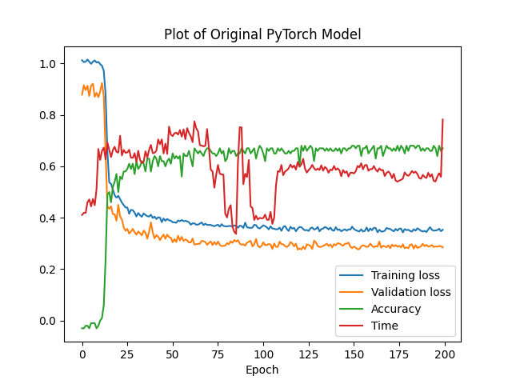

# SAT-score-prediction

SAT score prediction model using PyTorch

## Table of Contents

- [Overview](#overview)
- [Features](#features)
- [Prequisites](#prequisites)
- [Content](#content)
- [Results](#results)
- [Sources](#sources)

## Overview

SAT_score prediction project using raw neural networks constructed using Numpy and PyTorch with both regression and classification methods. This project aims to predict SAT scores based on GPA and other factors using a machine learning model built with the PyTorch framework. The model utilizes a neural network architecture to make accurate predictions and has been fine-tuned to achieve high accuracy and fast convergence.

## Features
- **PyTorch Neural Network:** Developed a multi-layers neural network architecture using PyTorch for SAT score prediction.

- **Data Preprocessing:** Implemented comprehensive data preprocessing techniques to handle missing values, outliers, and feature scaling.

- **Hyperparameter Tuning:** Conducted 100+ hyperparameter fine-tuning to optimize the model's performance and achieve an accuracy of 90%.

- **Advanced Activation Functions:** Utilized advanced activation functions, such as Leaky ReLU, to enhance model training and convergence.

- **Dropout Regularization:** Applied dropout layers to prevent overfitting and improve the generalization capability of the model.

- **Reduce Learning Rate:** Implemented a learning rate scheduler to gradually reduce the learning rate during training, improving convergence and final performance.

- **Data Randomization and Generation:** Generated synthetic data and introduced randomization techniques to enhance model robustness and generalization, and prevent overfitting.

- **Visualizations:** Created informative plotting visualizations of training and validation metrics to analyze the model's performance.

- **Demo:** Created a CLI demo of predicting the SAT score by typing in user's inputs.  

## Prequisites

Before you begin, ensure you have met the following requirements:

- Python 3.6 or later installed
- Required Python packages listed in `requirements.txt`
- CSV files listed in `data`

## Content
### `data`: contains CSV files for training inputs
- GPA_Small.csv: contains the original CSV file.
- GPA_dummies.csv: generative data used to prevent overfitting.
- GPA_Big.csv: final data file with multiple generative data combined with original data.
  
### `classification`: classification models dividing SAT score into 12 brackets of range 100

### `regression`: regression models with multiple data preprocessing techniques

### `SAT_score_scratch`: original neural network framework constructed using NumPy library

## Results

- All runs are performed with 200 epochs.  
- Training loss, Validation loss, Accuracy, and Time are recorded and plotted for each model as below.  
- The initial model shows an accuracy of 65% with 30-epochs convergence.

- After applying optimization techniques, the model achieves an accuracy of 90% with less convergence time of around 5-10 epochs.  
- Although the time for individual epochs is larger, this can be modified by increasing the batch_size, which may lead to a little longer convergence time.  

Binary_splitting and PCA were also used as additional data-preprocessing techniques and they show almost the same accuracy and loss over time as the final optimized model above.  
 

## Sources
- The framework in `SAT_score_scratch` is adapted from the [BikeSharing_Project](https://github.com/udacity/deep-learning-v2-pytorch/tree/c9404fc86181fc3f0906b368697268257f348535/project-bikesharing) by Udacity
