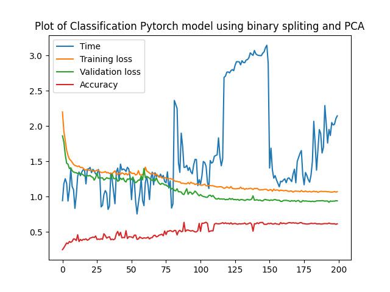

# Classification with Binary Splitting

In an attempt to classify SAT scores into 12 brackets using the binary splitting technique, a model was trained and evaluated. The results, as illustrated in the plot below, demonstrate a general improvement in accuracy over time. However, concerns arise regarding overfitting as the validation loss steadily increases.

# Classification with Binary Splitting and PCA

To mitigate the overfitting observed in the previous classification model, the PCA technique was applied in combination with binary splitting. While overfitting was reduced, the accuracy remained relatively constant, hovering around 60%.

Despite utilizing classification techniques and PyTorch's capabilities, it became evident that data generation plays a pivotal role in enhancing model accuracy. The classification approach, in this case, did not yield the desired results.
